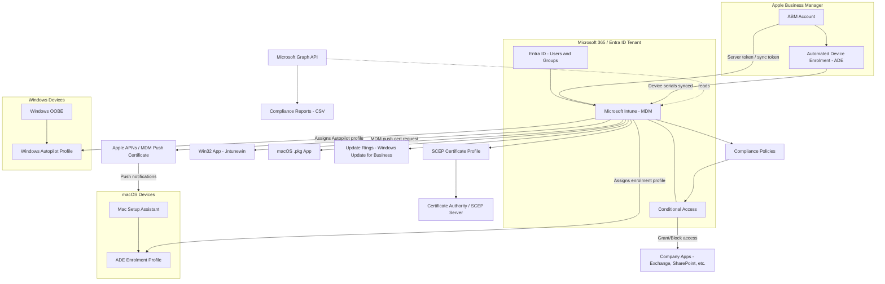

# EUC Device Management Lab

A hands-on lab for practicing modern endpoint management (EUC / Unified Endpoint Management) with **Microsoft Intune**, **Apple Business Manager (ABM)**, and the **Microsoft Graph API**.

This repo is my personal interview-prep lab. It is built so I can:

- Stand up a real (trial) Microsoft 365 / Intune tenant
- Link it to Apple Business Manager for zero-touch Mac enrolment
- Enrol a Windows device with Autopilot
- Build compliance policies tied to Conditional Access
- Package and deploy a Win32 app and a macOS pkg
- Design Windows Update for Business deployment rings
- Issue a certificate to a device with a SCEP profile
- Pull compliance data out with Microsoft Graph PowerShell

Everything in `scripts/` is meant to be run for real, against a real (test) tenant and a real test device. Everything in `runbooks/` is a template I fill in **as I do the work**, including a "What I Broke On Purpose" section — because the fastest way to actually learn a platform is to break it on purpose and fix it.

## Who this is for

Workplace IT engineer manage and building device management / EUC engineer.

Me, an IT engineer preparing for device management / EUC engineer interviews. The docs are deliberately written in simple English — plain enough to understand easily.

## Lab scope

| Area | What's covered |
|---|---|
| Tenant setup | Microsoft 365 / Intune trial tenant, admin roles, licensing |
| Apple Business Manager | ABM account, linking to Intune via MDM push (APNs) certificate, ABM token / sync token |
| macOS enrolment | Zero-touch enrolment via Automated Device Enrolment (ADE), enrolment profiles |
| Windows enrolment | Windows Autopilot profile, deployment profile assignment |
| Compliance & Conditional Access | Compliance policies (macOS + Windows), Conditional Access grant/block based on compliance |
| App packaging | Win32 app packaging (.intunewin) with detection rules; macOS .pkg packaging with pkgbuild/productbuild |
| Update management | Windows Update for Business deployment rings (pilot vs broad) |
| Certificates | SCEP certificate profile for Wi-Fi/VPN authentication |
| Reporting | Microsoft Graph API scripts for compliance reporting |

## Repository structure

```
euc-device-management-lab/
├── README.md                          <- you are here
├── runbooks/                          <- one runbook per lab stage, filled in as I go
│   ├── 01-tenant-setup.md
│   ├── 02-abm-intune-link.md
│   ├── 03-macos-ade-enrolment.md
│   ├── 04-windows-autopilot.md
│   ├── 05-compliance-and-conditional-access.md
│   ├── 06-win32-packaging.md
│   ├── 07-macos-pkg-packaging.md
│   ├── 08-update-rings.md
│   ├── 09-scep-profile.md
│   └── 10-graph-reporting.md
├── scripts/
│   ├── graph/                         <- Microsoft Graph PowerShell SDK scripts
│   ├── packaging/
│   │   ├── win32/                     <- .intunewin packaging + detection script
│   │   └── macos/                     <- pkgbuild/productbuild packaging
│   └── mac-utils/                     <- Mac-side verification scripts
└── notes/                             <- interview study notes
    ├── intune-vs-ws1-mapping.md
    ├── scep-explained.md
    └── update-rings-design.md
```

## Architecture diagram

How the pieces in this lab connect to each other:



## How I use this repo

1. Do the portal work myself in the Microsoft Intune admin center, Entra ID, and Apple Business Manager.
2. Run the scripts in `scripts/` against my own test tenant and test devices.
3. Fill in each runbook in `runbooks/` as I complete that stage — especially **What I Broke On Purpose** and **What I Learned**, since those are the answers I'll actually give in an interview.
4. Use `notes/` as flash-card style interview prep.

## Prerequisites

- A Microsoft 365 / Intune trial tenant (Global Admin or Intune Administrator role)
- An Apple Business Manager account (or Apple School Manager) — free to create with a D-U-N-S number, or use Apple's ABM sandbox where available
- A test Windows 10/11 VM or spare machine (Autopilot needs actual hardware IDs, or use a VM with a manually registered hardware hash)
- A test Mac (real ADE requires a Mac purchased through a reseller/Apple linked to your ABM — see [runbooks/03-macos-ade-enrolment.md](runbooks/03-macos-ade-enrolment.md) for a non-ADE fallback if you don't have one)
- PowerShell 7+ and the `Microsoft.Graph` PowerShell SDK module
- macOS with Xcode command line tools (for `pkgbuild`/`productbuild`)

## Status

This is a living lab. See each runbook for progress and lessons learned.
