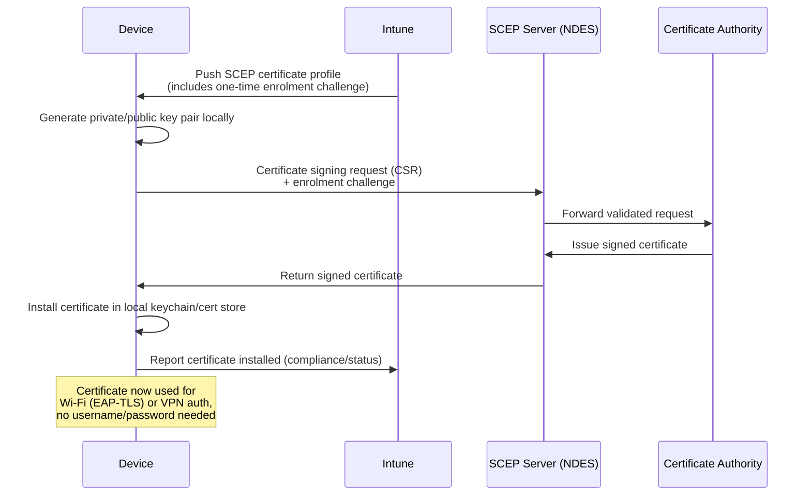

# SCEP Explained Simply

## What problem SCEP solves

Wi-Fi and VPN connections are often protected by a certificate instead of a
username/password. A certificate is harder to steal/phish than a password, and
it lets a device connect silently, with no login prompt. But someone has to get
that certificate onto every device, safely, without an IT person manually
requesting one for each user. **SCEP (Simple Certificate Enrolment Protocol)**
is the automated way MDM systems do that.

## The flow, in plain English

1. Intune pushes a **SCEP certificate profile** to the device (a set of
   instructions: "go get a certificate that looks like this").
2. The device generates its own private key locally (the key never leaves the
   device — this is the whole point of the security model).
3. The device sends a certificate **request** to a SCEP server, proving its
   identity with a one-time secret/challenge that Intune generated for it.
4. The SCEP server forwards that request to the actual Certificate Authority (CA).
5. The CA issues a certificate and it comes back down to the device.
6. The device now has a certificate it can present when connecting to Wi-Fi/VPN
   — no password typed, no user interaction needed.

## Sequence diagram

## Key vocabulary

- **NDES (Network Device Enrolment Service)** — the Windows Server role that
  actually speaks SCEP on behalf of an on-prem Active Directory Certificate
  Services (AD CS) CA. Cloud PKI services provide an equivalent endpoint without
  needing on-prem NDES.
- **Enrolment challenge** — a one-time secret Intune generates and passes to the
  device so the SCEP server can trust that this specific request really came from
  a managed device, not an attacker guessing at the endpoint.
- **Trusted root certificate profile** — deployed *before* the SCEP profile, so
  the device already trusts the CA that will sign its certificate. Order matters:
  deploy the root cert first.
- **EAP-TLS** — the Wi-Fi/802.1X authentication method that actually uses the
  certificate to authenticate, instead of a password (which would be EAP-PEAP/MSCHAPv2).

## Troubleshooting checklist — certificate-based Wi-Fi/VPN failures

When a device can't connect to a cert-protected Wi-Fi/VPN, work through this in order:

1. **Is the trusted root certificate actually installed on the device?**
   Check the local cert store (Windows: `certmgr.msc`; macOS: Keychain Access,
   System keychain). If missing, the SCEP profile likely failed before this step,
   or the root profile assignment doesn't match the SCEP profile's device group.

2. **Was the device certificate actually issued?**
   Check the cert store for a certificate with the expected Subject Name /
   Enhanced Key Usage = Client Authentication. In Intune, check
   **Devices > Monitor > Certificates** for issuance status/errors for that device.

3. **Is the SCEP/NDES endpoint reachable from the device?**
   A device off the corporate network (or without the right VPN/network path) may
   never be able to complete the challenge round-trip. Confirm DNS resolution and
   connectivity to the SCEP server URL configured in the profile.

4. **Has the NDES service account password expired?**
   A classic, easy-to-miss cause of a sudden mass SCEP failure — the NDES service
   account credentials rotate/expire on a schedule separate from the certificates
   themselves.

5. **Does the Subject Name / SAN format match what the RADIUS/VPN server expects?**
   If the cert is issued fine but auth still fails at the network layer, the
   RADIUS server (Wi-Fi) or VPN gateway may be validating a username/SAN format
   that doesn't match what the SCEP profile put in the certificate (e.g.
   expecting `UPN` in the SAN but the profile only set `CN`).

6. **Is the certificate expired or close to its renewal threshold?**
   Confirm the SCEP profile's validity period and renewal threshold — a cert that
   silently expired without a timely renewal will cause auth to start failing with
   no configuration change at all.

7. **Was the trusted root cert profile deployed before the SCEP profile, and to
   the same device group?**
   Mismatched assignment groups between the root cert profile and the SCEP
   profile is a very common configuration mistake in early SCEP setups.
