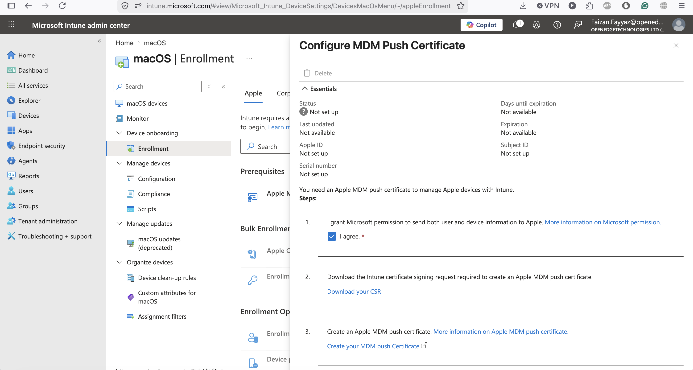
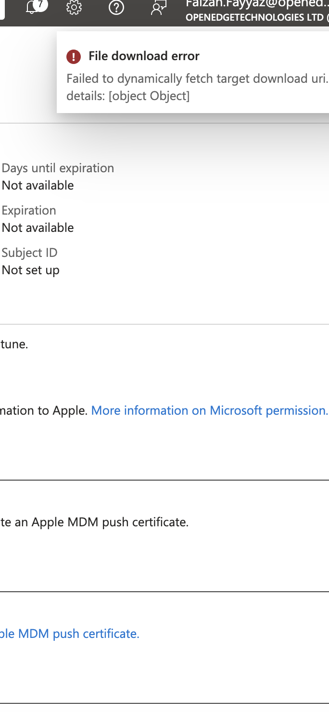
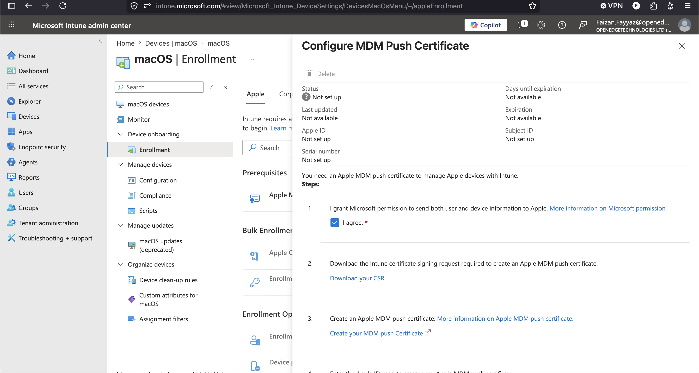

# Runbook 02 — ABM ↔ Intune Link

## Objective

Link Apple Business Manager (ABM) to Intune so that Intune can see Apple devices purchased/assigned to my organization, and can push MDM enrolment automatically (zero-touch) via Automated Device Enrolment (ADE). This requires two separate trust relationships: an MDM push certificate (Apple trusts Intune to talk to devices) and an ABM server token (Intune trusts ABM to know which devices belong to me).

## Prerequisites

- Completed [01-tenant-setup.md](01-tenant-setup.md)
- An Apple Business Manager account (business.apple.com) — sign up with a company Apple ID and D-U-N-S number, or use an existing one
- Intune Administrator or Global Admin access
- An Apple ID dedicated to MDM (do **not** use a personal Apple ID) for the push certificate

## Steps

1. **Get the Apple MDM Push Certificate (APNs certificate)**
   1. In the Intune admin center, go to **Devices > Apple > Apple MDM Push certificate**.

      

   2. Download the CSR (certificate signing request) that Intune generates.
      - `[screenshot: Intune - download CSR]`
   3. Go to the [Apple Push Certificates Portal](https://identity.apple.com) and sign in with the dedicated MDM Apple ID.
   4. Upload the CSR and download the resulting `.pem` push certificate.
      - `[screenshot: Apple Push Certificates Portal - certificate created]`
   5. Upload the `.pem` back into Intune, and record the associated Apple ID (write it down somewhere safe — losing track of this Apple ID means having to re-enrol every Apple device when the cert needs renewal).
      - `[screenshot: Intune - MDM push certificate uploaded, showing expiry date]`
2. **Get the ABM server token (sync token)**
   1. In Apple Business Manager, go to **Settings > MDM Server Assignment** and add a new MDM server, name it something like `Intune-Lab-MDM`.
      - `[screenshot: ABM - add MDM server]`
   2. Download the **public key** from Intune (**Devices > Apple > Automated Device Enrolment > Add** in Intune admin center gives a `.pem` to upload to ABM).
      - `[screenshot: Intune - ADE public key download]`
   3. Upload that public key into the new ABM MDM server entry, then download the resulting **server token** (`.p7m` file) from ABM.
      - `[screenshot: ABM - server token downloaded]`
   4. Upload the `.p7m` token into Intune under **Devices > Apple > Automated Device Enrolment**.
      - `[screenshot: Intune - ADE token uploaded successfully, showing token expiry]`
3. **Assign devices to the MDM server in ABM**
   1. In ABM, go to **Devices**, find (or add) my test Mac by serial number, and assign it to the `Intune-Lab-MDM` server.
      - `[screenshot: ABM - device assigned to MDM server]`
4. **Sync in Intune**
   1. In Intune, go to **Devices > Apple > Automated Device Enrolment**, select the token, and click **Sync now**.
      - `[screenshot: Intune - ADE sync complete, device appears]`
   2. Confirm the test Mac's serial number now shows up under **Devices > Enrolment > Apple enrolment > Enrolment Program Devices**.

## What I Broke On Purpose

Hit "Failed to dynamically fetch target download uri" trying to download the Apple push cert CSR.

Turned out the tenant's MDM authority was still "Unknown" because no enrolment method had ever been configured — Intune's own error message didn't say this, I had to check the browser console and find a 400 Bad Request on the underlying Graph API call before finding the real cause.

Fixed by manually triggering the MDM Authority picker via a direct URL to the ChooseMDMAuthorityBlade.

## What I Learned

_Fill in after doing the work._

-

## Production Considerations

- The MDM push certificate must be renewed every 365 days using the **same Apple ID** that created it — losing access to that Apple ID means every enrolled Apple device must be wiped and re-enrolled. Document the Apple ID somewhere the whole team can access (shared mailbox), not one person's personal account.
- The ABM server token also expires (every year) and needs manual renewal — set a calendar reminder well before expiry.
- Large organizations often run multiple MDM server tokens in ABM (e.g., one per business unit or region) so a token issue doesn't take down enrolment for the whole company at once.
- Device assignment to the MDM server in ABM can be automated by resellers at time of purchase (drop-ship), removing the need for IT to manually add serials.
