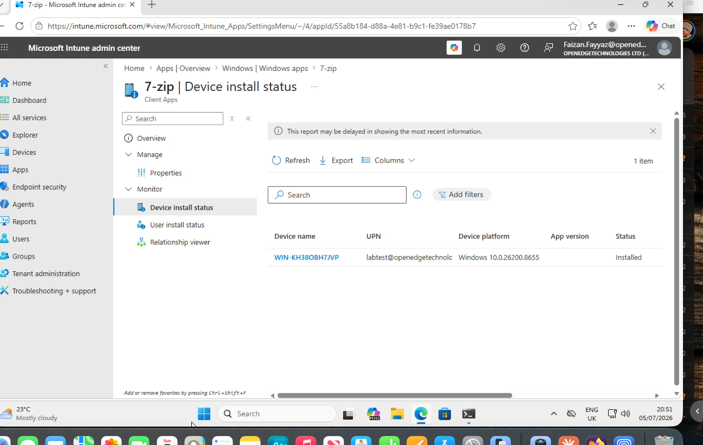

# Runbook 06 — Win32 App Packaging

## Objective

Package a real Windows application as a Win32 app (`.intunewin`), deploy it through Intune, and prove detection logic actually works — not just "it installed," but "Intune correctly knows whether it's installed."

## Prerequisites

- Completed [04-windows-autopilot.md](04-windows-autopilot.md) — at least one enrolled Windows test device
- An installer to package — this lab uses 7-Zip as the example (small, free, silent-install switches are well documented)
- [scripts/packaging/win32/package-app.ps1](../scripts/packaging/win32/package-app.ps1) and the 7-Zip example files in the same folder

## Steps

1. **Download the source installer**
   1. Download the 7-Zip MSI/EXE installer into a source folder, e.g. `C:\intune-lab\7zip-source\7z2301-x64.exe`.
      - `[screenshot: source folder contents]`
2. **Wrap it into a .intunewin file**
   1. Run [scripts/packaging/win32/package-app.ps1](../scripts/packaging/win32/package-app.ps1), pointing `-SourceFolder` at the source folder and `-SetupFile` at the installer.
   2. Confirm the script downloads `IntuneWinAppUtil.exe` (if not already present) and produces a `.intunewin` file.
      - `[screenshot: PowerShell output showing .intunewin created]`
3. **Create the Win32 app in Intune**
   1. Go to **Apps > Windows > Add > Win32 app**, upload the `.intunewin` file.
   2. Fill in app info (name, description, publisher, logo).
      - `[screenshot: app info tab]`
   3. Program tab: install command `7z2301-x64.exe /S`, uninstall command from [scripts/packaging/win32/7zip-example/uninstall-7zip.ps1](../scripts/packaging/win32/7zip-example/uninstall-7zip.ps1).
      - `[screenshot: program tab]`
   4. Requirements tab: architecture (x64), minimum OS.
   5. Detection rules: use the custom script [scripts/packaging/win32/7zip-example/detect-7zip.ps1](../scripts/packaging/win32/7zip-example/detect-7zip.ps1) (see `scripts/packaging/win32/README.md` for why a script-based detection was chosen over the built-in MSI rule for this example).
      - `[screenshot: detection rules tab]`
   6. Assignment: assign as **Required** to `Lab-Test-Devices`.
      - `[screenshot: assignment tab]`
4. **Deploy and verify**
   1. Sync the test device (Company Portal > Sync, or wait for the normal check-in cycle).
   2. Confirm install succeeds: **Apps > Monitor > App install status** shows the device as `Installed`.
      - `[screenshot: install status - Installed]`
   3. On the device, verify 7-Zip is actually present (Programs and Features, or `Get-ItemProperty` on the uninstall registry key).
      - `[screenshot: registry/Programs and Features confirming install]`
5. **Break the detection rule on purpose** (see below) and observe what Intune reports.

## What I Broke On Purpose

I didn't have to break anything on purpose here — three real issues surfaced on their own, and the third is exactly the "detection says failed but the app is installed" scenario this runbook exists to teach.

- **The packaging script itself broke under Windows PowerShell 5.1.** Running `package-app.ps1` on the VM failed with *"The string is missing the terminator"* / *"Missing closing '}'"* parse errors. Root cause: the script contained a Unicode em-dash (`—`) in a `Write-Warning` string, and the file is saved as UTF-8 without a BOM. The default `powershell.exe` (Windows PowerShell 5.1) reads script files as the system ANSI codepage, not UTF-8, so the em-dash got mangled into invalid bytes and the parser lost track of the string. Fixed by replacing the em-dash with an ASCII hyphen. Immediate workaround to keep moving was to call `IntuneWinAppUtil.exe` directly with the same `-c`/`-s`/`-o -q` arguments the script would have used, which produced the `.intunewin` fine.
- **The app showed "Not applicable" and never installed — because the VM is ARM64.** After creating the Win32 app and assigning it, the device sat at **Not applicable** in the install-status report, and the IME log showed check-ins happening but no attempt to download/install 7-Zip. "Not applicable" means the device fails the app's **requirement rules**, so I checked them: I'd set *Check operating system architecture = 64-bit (x64)*. But `$env:PROCESSOR_ARCHITECTURE` on the VM returned **ARM64** — because it's a Windows 11 ARM VM running under UTM/QEMU on an Apple Silicon Mac, not an x64 machine. An x64 architecture requirement excludes an ARM64 device. Fixed by editing the app's Requirements to *"No. Allow this app to be installed on all systems."* Windows 11 ARM64's built-in x64 emulation then ran the x64 7-Zip installer fine, landing it in `C:\Program Files\7-Zip`.
- **The installer succeeded but Intune reported "Failed" — a detection-rule bug.** Once applicable, the install ran and `Test-Path "C:\Program Files\7-Zip\7zFM.exe"` returned **True** — 7-Zip was genuinely installed — yet Intune reported the app as **Failed**. Classic install-vs-detection mismatch. Read the actual uninstall registry entry on the device and found `DisplayName = "7-Zip 23.01 (x64)"`, but the detection script matched `$_.DisplayName -eq "7-Zip"` (exact). `"7-Zip"` never equals `"7-Zip 23.01 (x64)"`, so detection returned not-detected -> exit 1 -> Intune concluded the install failed. Fixed by changing the exact match to a prefix match: `-like "$appName*"`. Re-uploaded the corrected `detect-7zip.ps1` in the app's Detection rules and re-triggered the IME (`Restart-Service IntuneManagementExtension -Force`). The status flipped to **Installed**, and running the corrected detection script manually confirmed it: `Detected 7-Zip version 23.01`, exit code 0.

## What I Learned

- Windows PowerShell 5.1 reads script files as the system ANSI codepage, not UTF-8, so any non-ASCII character (em-dash, curly quotes) in a UTF-8-without-BOM `.ps1` can produce a confusing parse error that has nothing to do with the logic. Keep scripts pure ASCII, or save as UTF-8 **with** BOM. PowerShell 7 (`pwsh`) doesn't have this problem, which is a giveaway when a script "works in one shell but not the other."
- A lab VM virtualized on Apple Silicon is **ARM64**, and that quietly changes Win32 app behaviour: an x64 architecture *requirement* makes the app evaluate as "Not applicable" (it never even tries to install), which looks like nothing is happening rather than an error. `$env:PROCESSOR_ARCHITECTURE` is the fastest way to confirm the real architecture. x64 apps still *run* on ARM64 via emulation, so the fix is to relax the architecture requirement, not to find an ARM64 build.
- "Not applicable" vs "Failed" are very different signals: *Not applicable* = the device doesn't meet a **requirement rule** (nothing installs), *Failed* = the install ran but the **detection rule** didn't confirm it. Diagnosing them means looking in different places (requirements vs detection).
- A detection rule is the *only* thing that tells Intune whether an app is present, independent of the installer's exit code. Testing detection against the **exact** registry `DisplayName` string on a real installed copy — not an assumed name — is essential. `-like "AppName*"` is safer than `-eq "AppName"` because vendors append version/architecture suffixes to the DisplayName.
- The Intune Management Extension (IME) is what actually installs Win32 apps, and it's only provisioned once a device has its first Win32 app or PowerShell script assigned — so the very first Win32 app on a device is slow. Its natural evaluation timer is ~1 hour; `Restart-Service IntuneManagementExtension -Force` forces an earlier pass. The IME log at `C:\ProgramData\Microsoft\IntuneManagementExtension\Logs\IntuneManagementExtension.log` is the ground truth, and it updates well before the admin-center report (which is explicitly "delayed").
- A detection script that "cannot be loaded because running scripts is disabled" in an interactive session still runs fine under Intune — the IME invokes detection scripts with `-ExecutionPolicy Bypass`. To test one by hand, use `Set-ExecutionPolicy -Scope Process -ExecutionPolicy Bypass -Force` first; it doesn't reflect how Intune runs it.

## Production Considerations

- Detection rules are the single most common cause of "the app shows as failed but it's actually installed" tickets — always test detection logic against the exact installed version string, not an assumption.
- Version-specific detection rules (checking for a minimum `DisplayVersion`) let you use the same app to service both "not installed" and "needs upgrade" scenarios via app supersedence.
- Silent install/uninstall switches vary per vendor — always verify with the vendor's documentation or `installer.exe /?` rather than guessing.
- Consider app dependencies and supersedence chains for larger app catalogs, rather than one flat list of unrelated Win32 apps.
