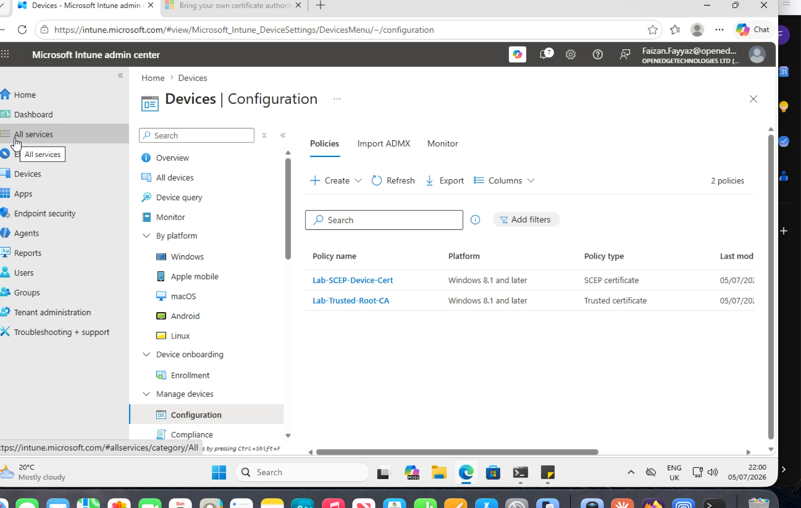
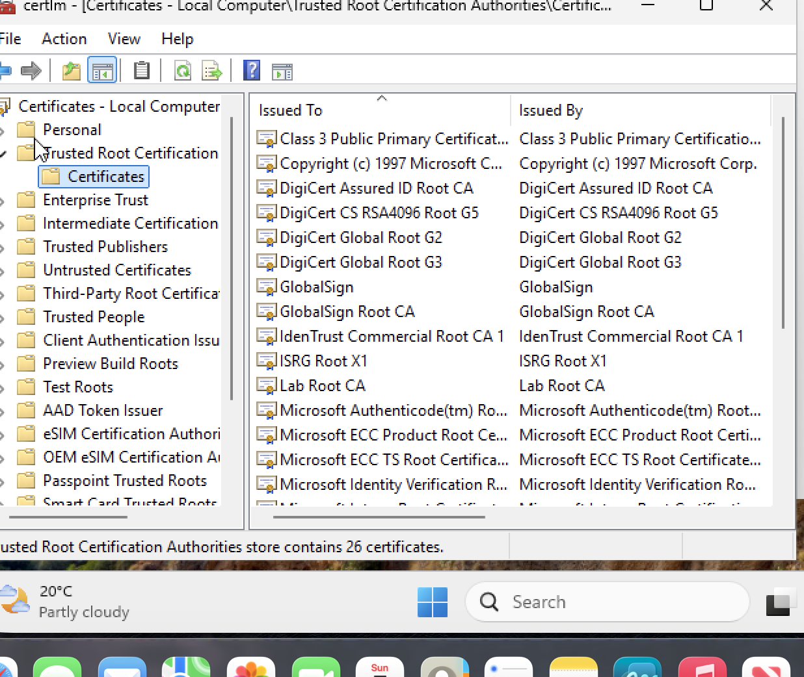

# Runbook 09 — SCEP Certificate Profile

## Objective

Deploy a device certificate via SCEP (Simple Certificate Enrolment Protocol) through Intune, so devices can authenticate to Wi-Fi/VPN without a username/password — the standard "certificate-based auth" pattern.

## Prerequisites

- Completed [04-windows-autopilot.md](04-windows-autopilot.md) or [03-macos-ade-enrolment.md](03-macos-ade-enrolment.md) — at least one enrolled test device
- Read [notes/scep-explained.md](../notes/scep-explained.md) first — it has the SCEP flow diagram and vocabulary this runbook assumes
- A Certificate Authority (CA) reachable by Intune. For a lab without an on-prem CA + NDES server, use one of:
  - A trial of a cloud SCEP/PKI service (several vendors offer this, check current trial availability)
  - A minimal test setup with Windows Server AD CS + NDES role, if I have a lab VM available
  - If neither is feasible, complete this runbook as a **desk exercise**: build the trusted root certificate profile and the SCEP profile in Intune fully, note in "What I Broke On Purpose" that live enrolment wasn't possible, and record what error/state is expected without a reachable CA

## Steps

1. **Deploy the trusted root certificate profile first**
   1. Go to **Devices > Configuration > Create > New Policy > Trusted certificate**.
   2. Upload the root CA's `.cer` file.
      - `[screenshot: trusted root cert profile]`
   3. Assign to `Lab-Test-Devices`.
2. **Create the SCEP certificate profile**
   1. Go to **Devices > Configuration > Create > New Policy > SCEP certificate**.
   2. Certificate type: **Device**. Subject name format: `CN={{DeviceName}}` (or a serial/UPN variant).
   3. Key usage: Digital signature + Key encipherment. Key size: 2048.
   4. Extended key usage: Client Authentication.
   5. Root certificate: select the trusted root profile from step 1.
   6. SCEP server URL(s): point at the NDES/SCEP server endpoint (or cloud PKI connector endpoint).
      - `[screenshot: SCEP profile configuration]`
   7. Assign to `Lab-Test-Devices`.
      - `[screenshot: assignment]`
3. **Verify certificate issuance**
   1. On the test device, check the certificate store: Windows — `certmgr.msc` (Personal > Certificates); macOS — Keychain Access (System keychain).
      - `[screenshot: issued certificate visible in cert store]`
   2. In Intune, check **Devices > Monitor > Certificates** (or the device's certificate status blade) to confirm Intune also sees it as issued.
      - `[screenshot: Intune certificate status]`
4. **Use the certificate in a Wi-Fi or VPN profile (if applicable)**
   1. Create a Wi-Fi profile that references the SCEP certificate for EAP-TLS authentication, assign to the same group.
      - `[screenshot: Wi-Fi profile referencing SCEP cert]`
   2. Test connecting to the test SSID/VPN and confirm no username/password prompt appears — auth happens silently via the cert.
      - `[screenshot: successful cert-based connection]`

## How this was actually done: Microsoft Cloud PKI (no on-prem CA/NDES)

The prerequisites list an on-prem AD CS + NDES server or a cloud SCEP service as the CA. This tenant's **Intune Suite license includes Microsoft Cloud PKI**, so the entire certificate authority was stood up **in the cloud, inside Intune** — no on-prem AD CS, no NDES connector, no server to maintain. This is the modern, cloud-only path and it worked end-to-end:

1. **Built a two-tier CA hierarchy in Cloud PKI** (Tenant admin > Cloud PKI): a **Root CA** (`Lab-Root-CA`, RSA-4096/SHA-512, EKU constrained to Client Authentication, 10-year) and an **Issuing CA** (`Lab-Issuing-CA`, chained to the root, RSA-4096/SHA-512, 5-year). The Intune-hosted root **auto-signed** the issuing CA's request (status went "Signing pending" -> "Active" on its own; the Download-CSR/Upload-signed-cert buttons are only for bring-your-own external roots).
2. **Trusted certificate profile** (`Lab-Trusted-Root-CA`) deploying the root CA cert to the device's Computer > Trusted Root store.
3. **SCEP certificate profile** (`Lab-SCEP-Device-Cert`): subject `CN={{AAD_Device_ID}}`, TPM-if-present KSP, Digital signature + Key encipherment, 2048-bit leaf key, EKU Client Authentication, referencing the trusted-root profile and the Cloud PKI issuing CA's SCEP URI.
4. Assigned both profiles to the device, restarted it to force check-in.

**Verified on-device with `certlm.msc` (the ground truth):**
- Trusted Root store contains **Lab Root CA** (delivered by the trusted-root profile):

  

- Personal store contains a certificate **Issued By "Lab Issuing CA"**, subject = the device's AAD Device ID (`52022cd1-4714-...`) — which matches exactly the `DeviceId` from `dsregcmd /status`. The device generated a keypair, sent a CSR to the cloud issuing CA over SCEP, and the issued leaf cert landed in the Personal store chaining to the root. Full success.

## What I Broke On Purpose

- **The Create-CA wizard's root CA picker showed "No matching CAs found"** even when the exact root CA name was typed in full, immediately after the root went Active — a stale cached list in the wizard. Confusingly, the issuing CA creation actually *succeeded* despite the picker looking empty; closing and reopening the wizard (or refreshing the Cloud PKI list) resolved the display. Lesson: don't trust an empty picker right after creating a dependency — refresh first.
- **The Intune-side SCEP profile "Device status" showed 0 records / "No results" even after the certificate was confirmed issued on the device.** Same admin-center reporting lag seen throughout this lab (Win32 install status, compliance, update rings) — the portal report trails real device state by many minutes. `certlm.msc` on the device proved issuance succeeded well before the portal caught up. Never conclude "it failed" from a lagging admin-center report alone.

## What I Learned

- **Microsoft Cloud PKI removes the single biggest barrier to SCEP** — the traditional on-prem AD CS + NDES + Intune Certificate Connector stack (and its notorious NDES service-account-password outages). A cloud-only org can stand up a full CA hierarchy and issue device certs entirely from Intune. For a lab, it turns a runbook that would otherwise need a Windows Server VM into a 20-minute portal exercise.
- **The two-tier design mirrors real PKI practice:** the root CA constrains what its issuing CA (and their leaf certs) can do via EKUs — setting Client Authentication on the root cascaded down so the whole chain is scoped to device/user auth. Only *issuing* CAs issue leaf certs; the root exists to anchor trust.
- **The SCEP flow has three moving parts working together:** the trusted-root profile makes the device *trust* the CA, the SCEP profile makes the device *generate a keypair and request* a cert from the CA's SCEP endpoint, and the issued leaf cert lands in the Personal store *chaining* to that trusted root. Miss any one (no trusted root, wrong SCEP URL, wrong root reference in the SCEP profile) and either no cert issues or it issues but won't validate.
- **`CN={{AAD_Device_ID}}` gives a stable, unique, verifiable subject** — it matches `dsregcmd /status`'s DeviceId, so you can prove on the device exactly which Entra device a cert belongs to.
- This SCEP-issued cert is what a **Wi-Fi/VPN profile (EAP-TLS)** would then reference for passwordless, certificate-based network authentication — the ultimate purpose of the whole exercise.

## Production Considerations

- NDES (Network Device Enrolment Service) has known scaling/security quirks — the NDES connector needs monitoring, and its service account password rotation is a classic outage cause in real environments.
- Certificate renewal should happen automatically before expiry (SCEP profiles support a renewal threshold) — monitor certificate expiry proactively rather than waiting for auth failures.
- Subject name and SAN (Subject Alternative Name) format must exactly match what the Wi-Fi/VPN/RADIUS server expects — mismatches are the most common cause of "cert issued fine but auth still fails."
- See [notes/scep-explained.md](../notes/scep-explained.md) for the full troubleshooting checklist used when a cert-based Wi-Fi/VPN connection fails.
